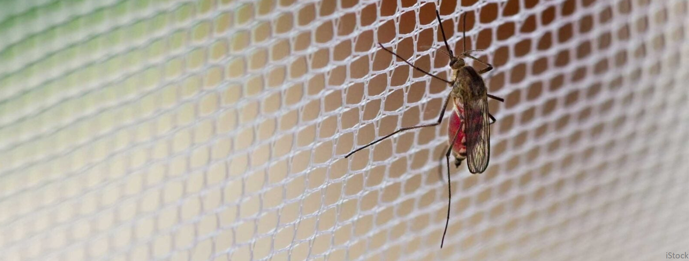

# Bed-Net Optimisation App

The purpose of the app is to explore the predicted optimality of bed-nets in response to variation in the loading of insecticides onto bed-nets, and the useable lifespan of bed-nets in the number of years that they are used before redeployment.

## How to use the App

In the Basic settings, the App allows a user to choose a resistance-management strategy (Mixture, Rotation, Mosaic), a public health budget for the purchasing of bed-nets and two insecticides for use on bed-nets (from: Pyrethroids, PBO, Chlorfenapyr, Pyriproxyfen and two other idealised New AIs).

The App can then run a simulation to calculate the level of vector control that is achieved over many years across different chemical loadings of insecticides and deployment lifespans of bed-nets.

The App calculates the chemical loadings and deployment lifespan that satisfy alternative optimality criteria, and presents a set of figures for the comparison of these results under alternative optimality criteria.

It is possible to save a simulation by exporting a file that can also be imported into the App for the comparison of the results under alternative optimality criteria across multiple simulations.

The optimality criteria represent different concepts of what makes a 'good' bed-net:

- BL: A baseline scenario taken from experimental hut data that assumes that both insecticides have their standard loading and that a bed-net is deployed for a lifespan of 3 years;
- MC: The global optimum that maximises the vector control that is achieved over the entire simulation (i.e. across the full range of the chemical loadings and bed-net lifespans);
- CW: The optimum that is incentivised by the WHO commoditisation policy, which favours the cheapeast bed-net that satisfies the WHO requirements for recommending the use of a bed-net, which must achieve >80% mortality in a bioassay after 3 years of deployment and be redeployed every 3 years as a fixed deployment lifespan;
- MW: The optimum that maximises the vector control within the WHO requirements for recommending the use of a bed-net, which must achieve >80% mortality in a bioassay after 3 years of deployment and be redeployed every 3 years as a fixed deployment lifespan;
- UC: The optimum that maximises the vector control within the requirement for universal coverage (ignoring WHO requirements).

## Doing more with the App's advanced settings

Some users may also wish to explore a wider range of scenario definitions, which is possible through the Advanced settings. To modify these parameters, it is necessary to understand a bit more about how the simulation works.

The simulation involves the calculation of the level of vector control across a set range of chemical loadings and bed-net lifespans. The range can be modified by changing the maximum value and the search interval, which (please note) will alter the time it takes for a simulation to run, and so alter the speed that a user can try something new and see what impact this has on the results.

Each combination of chemical loadings and bed-net lifespan involves the iterative calculation of properties of each mosquito generation that change in an underlying evolutionary model. The setup is simple (for computational speed), using a logistic (r/K) model of population change and an infinite population model of allele frequency change.

The effect of bed-nets on the mosquito population varies through time because of the decay of insecticides on bed-nets (that reduces the mortality effect of the bed-nets) and the deterioration of the fabric of the bed-net (that reduces the quality of the physical barrier to biting).

It is not possible to edit the chemical and/or mortality effects because they are derived from data, but it is possible to subsidise each insecticide, which can favour the use of greater concentrations of insecticide.

The default physical effect is also derived from data, but can be modified by a user; the default values reflect the average across available data, but there is heterogeneity that the user can manually explore by altering these parameters.

## Doing even more with the App's expert settings

Some users may wish to go further and consider new or hypothetical insecticides. For this purpose, users can enter the password 'expert' to reveal some Expert settings, which allows a user to manually define the chemical and mortality effects of two custom insecticides.

To modify these parameters, it is necessary to understand a bit more about the curves that describe the chemical and mortality effects. The chemical decay of insecticide on a bed-net is modelled as a negative exponential that is controlled by a single decay parameter. The mortality decay that results is modelled as a logistic that is controlled by a decay parameter and a half-life parameter. Both the chemical and mortality effect describe the baseline scenario (of a relative loading of 1 for each insecticide).

When the optimisation algorithim searches across chemical loadings, it calculates the modification in the mortality curve by finding the resulting time-displacement from the chemical curve's change in the relative loading.

Accordingly, as it is difficult to use intuition here to generate sensible values without understanding the impact that these expert parameters have on the curves that underlie the chemical and mortality effects, there is a means of testing the manually entered parameter values to visualise the resulting effects on the chemical and mortality curves. It is also possible to edit the names and cost of each custom insecticide.

## About the authors

This App was developed as part of a postdoctoral research position at Syngenta funded by the Bill & Melinda Gates Foundation through the Innovative Vector Control Consortium (IVCC).

The code-base for the application was developed by Matthias Wubs and Philip Madgwick, and the mathematical model (and its outputs) was developed by Philip Madgwick and Ricardo Kanitz.
